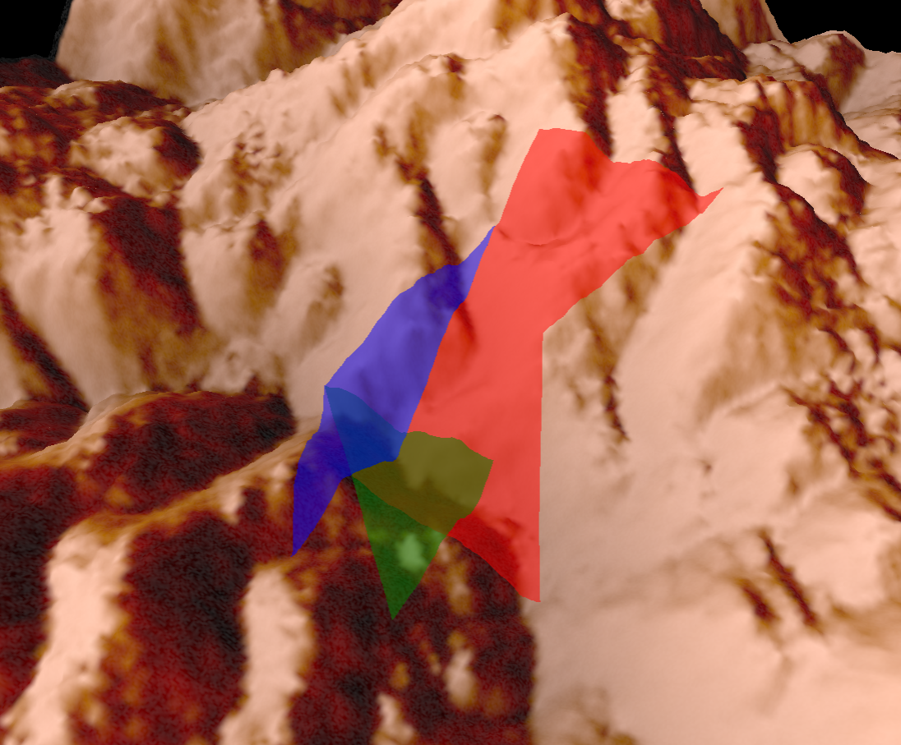

# threejs-clamp-to-ground
 A three js implementation of cesium.js' clampToGround options.

This repo shows how to draw 2d shapes on rugged surfaces using shadow volume and stencil buffer.

## Start
```
pnpm i 
npm run dev
```

## Showcase


